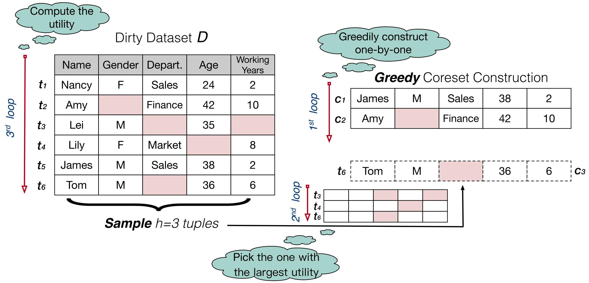
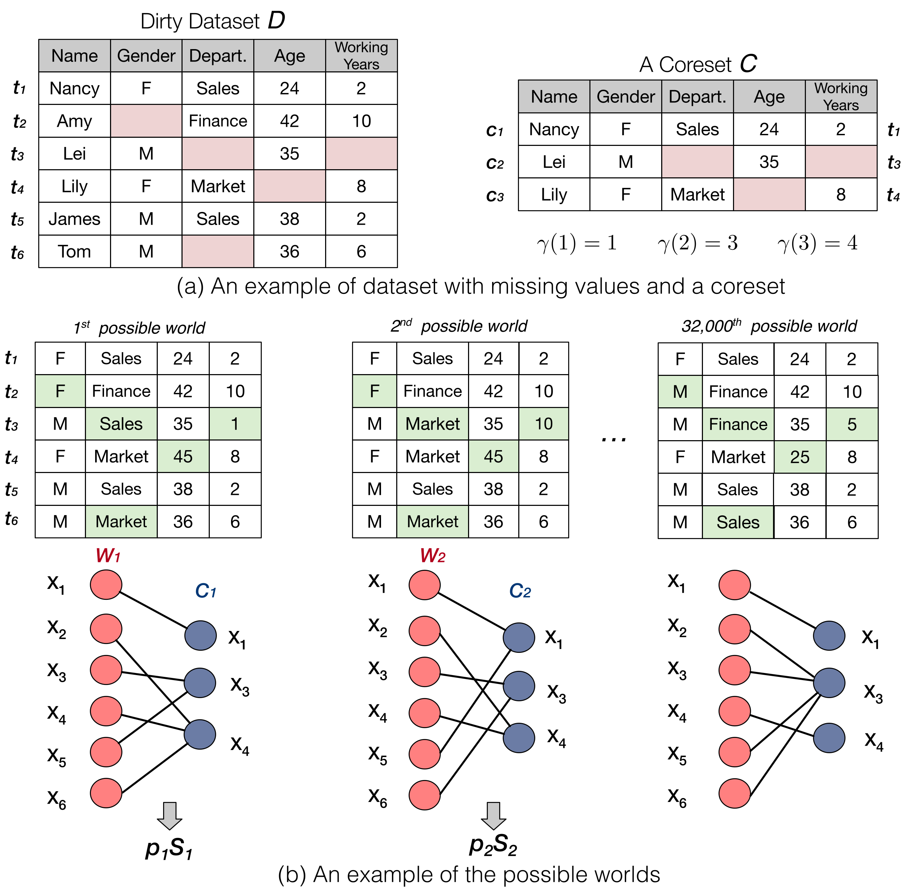

#  GoodCore 

GoodCore is a coreset selection framework over incomplete data for data-effective and data-efficient machine learning. It can select an expected optimal coreset through gradient approximation without training ML models.

GoodCore uses a greedy framework with three loops to solve the problem. At a high level, the greedy strategy adds one tuple with the largest “utility” to the coreset iteratively, which can be considered as the first loop. In each iteration, we have to iterate tuples in D to select the one with the largest utility, which is the second loop. Naturally, we have to compute the utility of each tuple, where all tuples in D have to be considered, leading to the third loop. 

Unfortunately, the 3-loop computation of the strategy is rather expensive due to the large number of possible worlds. To address this, we can integrate either human-in-the-loop or the automatic method into GoodCore framework. It iteratively imputes one incomplete tuple or a mini-batch of incomplete tuples. Once the tuple(s) is (are) computed and added to
the coreset within the first loop, the number of possible worlds can be significantly reduced, and so does the computational cost.

# Environment Setup

* `Python 3.8+`
* `scikit-learn == 1.0.2` 
* `numpy == 1.19.2`
* `pandas == 1.4.2`
* `random`
* `Datawig`

# Quick Start

## Requirements
Before running the code, please make sure your Python version is above 3.8. Then install Python dependency via `pip install -r requirements.txt` when the environment of Python and Pytorch is setup.

## Data Preparation
We provide an example about how to preprocess the dataset. Please refer to `GoodCore/Preprocess`.

## Parameters
Before running the code, you have to configure some parameters or use the default configuration.

* h: the number of tuples sampled from the training set
* K: the size of the coreset  
* b: the size of the batch that asks the human to impute per human iteration

## Imputation
If you involve a human to impute the missing value, you can interactive through the command line. You can add other automatic imputation methods as needed.

## Running Code
- `python logistic.py --data Example --method sgd -s 0.0002`

- `python logistic.py --data Example_clean --method sgd -s 0.0002`

## License

The project is available under the [MIT](LICENSE) license.

## Contact
If you have any questions, feel free contact us.

